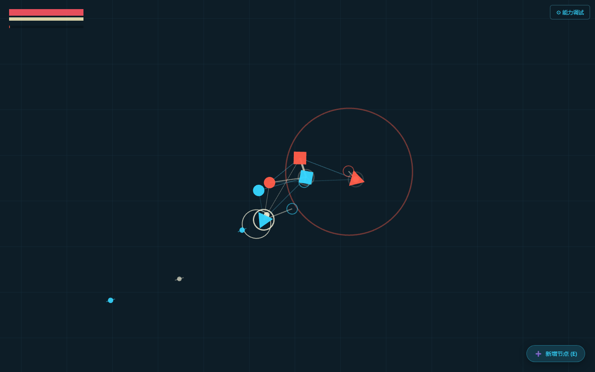
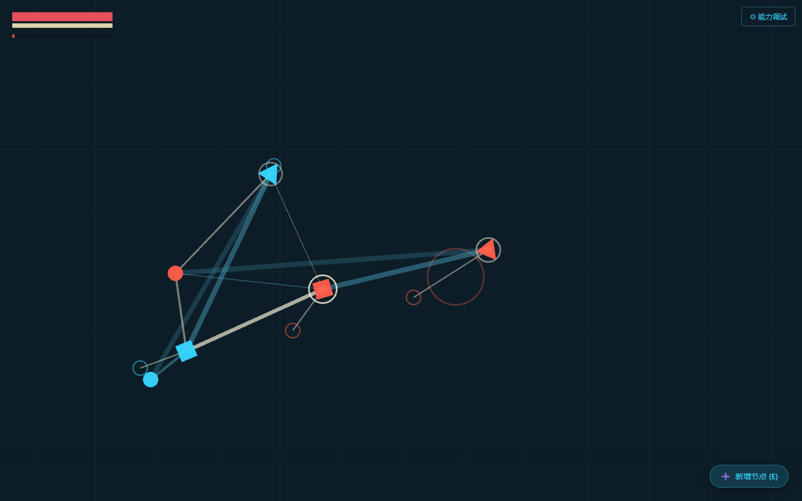
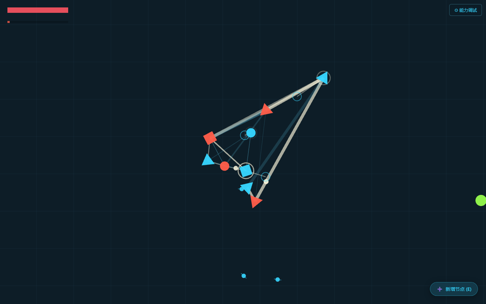

# 034 GameJam 核心实现报告：集群生物网状牵引移动系统

## 0. 这份文档的用途

这不是一份泛泛的玩法介绍，而是一份给后续正式开发阶段使用的“核心实现共识稿”。

它的目标有三个：

1. 让策划、美术、音效、UI 明确知道：当前真正落地、最亮眼、最值得继续放大的，究竟是什么。
2. 把“核心系统”与“playground 调试副产物 / 临时试验 / 屎山工具”分开，避免后续设计建立在错误前提上。
3. 让后续所有人围绕同一个核心体验推进：不是做一个会移动的几何体，而是做一个**由连接关系决定生命感、由脉冲牵引驱动运动感、由体积舒张制造侵袭感的集群捕食者**。

---

## 1. 项目背景与当前阶段判断

本次 034 GameJam 主题是：**连接**。

本次创作限制决定了，游戏不能依赖传统角色立绘、复杂模型、文字说明、具象生物造型去建立魅力，而必须把“连接”本身变成玩法、视觉、手感和叙事气质的一体化表达。

034 元素限制如下：

- 游戏实例只能由肉眼可辨的纯色圆形、三角形、矩形构成。
- 允许少量纹理、描边、倒角装饰，但不能喧宾夺主。
- 除游戏标题和成员名单外，游戏内其余地方禁止使用文字。
- 创作过程中不能直接使用基础图形以外的实例，也不能通过预先组合/形变去伪造别的图形。

这意味着，真正能撑起游戏气质的，不会是“画了什么”，而是：

- 这些基础图形如何互相连接；
- 这些连接如何传递力；
- 这些力如何组织出一种“活的”运动；
- 玩家如何像在驱赶、引诱、撕扯、逼迫一团生物组织去狩猎，而不是像开飞船一样直接开走。

在连续四天高强度开发后，当前版本最成熟、最独特、最值得被确立为正式主线方向的成果，不是敌人，不是数值，不是关卡，不是器官系统全套闭环，而是：

> **集群生物网状牵引移动系统本身。**

这是当前 demo 真正已经“站住”的东西，也是后续所有设计应该围绕它服务、检验、放大、修饰的中心。

---

## 2. 一句话定义当前游戏

当前这款游戏，不应再被理解为“玩家控制一个几何单位，并带着几个附属件行动”。

更准确的定义是：

> 玩家在操控一团由圆、方、三角节点组成的软体捕食集群。  
> 玩家输入的不是直接位移命令，而是一个“意图场”。  
> 这个意图场会驱动脉冲在节点间游走，节点依次向前抓地、撑开、回弹；  
> 再通过弹簧网络、体积排斥、PBD 保形和镜头前探，共同涌现出一种像活体器官、像虫群、像原生质一样的牵引式蠕动与侵袭。

这就是当前版本最宝贵的“味道”。

---

## 3. 当前已经落地的核心体验，应该如何理解

### 3.1 玩家感受到的不是“移动”，而是“牵引”

普通游戏的移动，是给角色一个速度，然后角色过去。

当前系统不是这样。

当前系统的移动本质是：

1. 局部节点被脉冲点亮。
2. 该节点短时间进入“抓地/生根”状态。
3. 它向前方某个虚拟锚点暴力拉扯自己。
4. 这个拉扯通过连线网络传播给全体。
5. 其他节点不是同步执行命令，而是在被拖、被拽、被压、被回弹。
6. 整个集群因此产生一种“前端探出去、后端被拖上来、中部被撑胖、结构又勉强没散”的活物运动感。

所以玩家操作时的感觉不是：

- 我在推一个物体；

而是：

- 我在逼迫一团会反抗的组织朝某个方向侵袭；
- 我在让前排节点拼命摸前路；
- 我在制造一次次局部抓地，借连接关系把全体扯过去；
- 我在“压缩、蓄势、舒张、扑出、回拢”之间循环。

这就是后续所有 gamefeel 应该守住的核心。

### 3.2 当前最好的一点，不是“有集群”，而是“集群内部有生物感分工”

当前节点不是装饰性挂件，它们在算法上和体感上都已有分工：

- 圆形节点偏向核心、供能、压缩、带动整体稳定。
- 方形节点更像结构与壳体，负责横向撑开、稳住、形成体块感。
- 三角节点更像前探、突刺、攻击性器官，负责把形体拉向锋利、主动、侵袭的方向。

因此当前集群不是“多个点一起动”，而是：

- 有的节点像在蹬地；
- 有的节点像在撑壳；
- 有的节点像在探针一样往前戳；
- 有的节点像被整个组织牵着走，但又不断反向拉扯整体。

这就让“连接”不只是图形关系，而变成了**角色内部器官协作关系**。

### 3.3 当前体验的最佳形容词

如果要用感性但准确的词去描述现在的手感，最贴切的是：

- 不是机械编队，而是**有骨相的软体**
- 不是果冻乱晃，而是**有意图的脉动生物**
- 不是坦克冲锋，而是**网状组织向前侵袭**
- 不是简单放大缩小，而是**收拢、巡航、逼近、扑猎、回弹**

后续不管美术、音效还是策划设计，最好都围绕这组气质继续放大，而不是把它改造成传统动作游戏的那种“清脆、干净、线性响应”的移动。

---

## 4. 当前版本真实生效的程序骨架

下面这一部分，专门描述“现在真正开着、真正影响手感”的核心算法链路。

### 4.1 主循环中的真实顺序

当前每帧的核心流程是：

```text
读取玩家输入
-> 计算鼠标世界距离驱动状态（内圈 / 中圈 / 外圈 / 爆发）
-> 计算集群体积状态（收缩 / 常态 / 舒张）
-> 推进脉冲在节点链中的游走
-> 命中节点后触发角色化的锚点牵引
-> 叠加漂移力 / 核心收束力 / 锚定力 / 弹簧力 / 排斥力
-> 速度积分
-> PBD 保形校正
-> 显示插值与镜头更新
-> 渲染
```

最关键的一点是：

**输入不会直接把节点坐标改掉，输入只是在影响一个层层传导的动力学过程。**

---

## 5. 当前玩家实体的真实构成

### 5.1 当前默认初始集群

当前开局默认是一个 **6 节点、10 连线** 的混色集群。

默认链条由以下角色组成：

- `source`：蓝色圆形
- `shell-a`：蓝色方形
- `dart-a`：蓝色三角
- `prism`：红色方形
- `compressor`：红色圆形
- `blade`：红色三角

也就是说，当前初始体已经天然具备（补充：但还不是最终版，可以被修改，目前仅为playtest设定）：

- 圆 / 方 / 三角三种形态
- 蓝 / 红两类极性
- 核心 / 外壳 / 探针 / 压缩 / 刀锋等不同运动语义

它并不是一个“占位体”，而是已经很明确地在为正式玩法探路。

### 5.2 当前红蓝两色的真实含义

当前版本里，红蓝已经不是单纯配色，而是物理语义的一部分（补充：不一定，后续可能会不分红蓝，看设计，不能因为这里限制美术发挥）。

但需要注意：

- **极性差异已经参与物理求解**
- **红蓝输入分驱目前还没有作为正式基线启用**

也就是说：

1. **已经生效的部分**
   - 同极节点与异极节点，在连线静息长度、刚度、阻尼上有差异。
   - 这让红蓝混编结构在运动中会出现更强的摩擦感、拧劲、异步感。

2. **当前未作为正式基线启用的部分**
   - `splitPolarityIntentDrive = false`
   - `enableUpgradedIntentDrive = false`
   - `legacyAllNodesMove = true`

这意味着当前正式手感下：

- 所有节点都还会参与主动运动；
- 红蓝尚未进入“红主要听 WASD、蓝主要听鼠标”的强分工模式；
- 但红蓝在结构反应上已经有物理差异。

这很重要，因为它说明：

> 当前版本真正成熟的是“极性混编带来的组织张力”，而不是“红蓝输入职责分工”。

后者是探索过、但还没成为当前正式答案的方向。

---

## 6. 当前拓扑系统：为什么它不是普通跟随阵型

### 6.1 当前结构不是 rigid body，不是 boids，不是蛇

当前结构从本质上说，是一张**动态图拓扑网**。

每个节点是质点，每条连线是物理约束。  
这张网不是拿来画出来好看的，它本身就是移动系统。

### 6.2 当前默认拓扑是“部分网格”，不是向日葵规整阵列

当前正式基线下：

- `enableSunflowerTopologySlots = false`

这意味着默认槽位不再采用老版黄金角向日葵排布，而是采用更适合前向生长、局部牵引和结构扩展的线性/前置布局。

这件事的体验意义非常大：

- 老版向日葵槽位更像展示整齐编队；
- 当前线性/前置布局更像一个会朝目标方向生长、爬行、伸出器官的组织。

### 6.3 当前连线自动生成逻辑

当前自动结构生成不是完全人工摆，也不是完全随机。

系统会：

1. 先为每个节点提供一个局部槽位。
2. 按距离、前向偏置和度数限制生成主干连接。
3. 再在局部半径内补充支撑边，形成部分网状支撑。
4. 限制单点连线过多，避免自动长成不可读的蜘蛛网。

这让当前结构具备两个重要特征：

- 有“主干”感
- 有“支撑面”感

因此它既不会像链条那样过于单薄，也不会像满网格那样一坨死板。

### 6.4 当前程序已支持多重边刚度分层，但默认基线没有开启

程序架构已经支持：

- 单边 = `flex`
- 双边 = `joint`
- 三边及以上 = `rigid`

并且会因此改变：

- 刚度
- 阻尼
- 容许伸长量
- PBD 约束权重

但是当前正式基线下：

- `enableCompoundTopologyEdges = false`

所以默认运行时不会主动保留重复边，也不会把同一对节点堆成多重韧带/硬骨。

这意味着当前版本最核心的体验，并不是“多重边硬骨体系”，而是：

> **单层 partial mesh 拓扑 + 角色化脉冲拉扯 + 体积舒张 + PBD 保形**

多重边刚度分层是**已经写进引擎、但目前刻意没作为正式基线打开的高级能力**。  
它更适合后续进入特化器官、Boss 结构、特殊生物构型时再接入，而不应该被误判为当前 demo 的主要卖点。

---

## 7. 当前最核心的驱动系统：脉冲巡游 + 节点抓地

### 7.1 当前“心跳”不是演出，而是真正的驱动引擎

集群内部有一个或多个脉冲运行器。

当前参数下：

- `autoPulseOrbCount = true`
- 脉冲数量会根据节点数自动调整

在 6 到 9 节点这个区间内，当前实机验证中保持为 **2 个 pulse orb** 同时巡游。

这些脉冲会沿节点链顺序向前推进，每命中一个节点，就触发一次 `triggerNode()`。

这不是视觉闪烁，而是真正触发该节点本轮行为的“执行时机”。

### 7.2 节点不是持续用力，而是轮流发劲

被脉冲命中的节点，会在短时间内：

1. 计算自己的前探锚点
2. 进入 `anchored` 状态
3. 用极强的锚定牵引把自己朝锚点拉过去
4. 在 `stanceTimer` 结束后解除锚定

公式可以理解为：

```text
F_anchor = (anchor - current) * anchorStrength
```

这里的关键，不是“节点被移到目标位置”，而是：

- 节点只是在一个短窗口里暴力发劲；
- 之后还要接受结构回弹、拉扯和保形修正；
- 所以结果不是机械位移，而是生物扑动。

### 7.3 不同节点的“发劲方式”不同

当前程序里，不同角色有不同的锚点生成参数：

- `source`
  - 前向中等，侧向也不低
  - 更像核心供能与基础带动点
- `compressor`
  - 前向更强，节奏更急
  - 会提高整体 tempo、agitation
  - 更像压缩泵与推进器
- `shell`
  - 前向不夸张，但侧向极大
  - 会横向撑开结构，形成壳体和体块
- `prism`
  - 更强调朝目标方向的引导
  - 有明显的转向与前探语义
- `dart`
  - 长距离刺出，偏远程或触须式前探
- `blade`
  - 最激进的前刺与切入感
  - 是当前最像“捕食器官”的节点

所以当前最好的感觉，实际上来自一种交替出现的组织行为：

- 有节点往前扎
- 有节点往侧面撑
- 有节点把整体节奏抬起来
- 有节点把结构往核心拉回

这也是为什么现在的移动会像“器官群协同收缩”，而不是简单多点推进。

---

## 8. 当前输入系统：玩家在注入“意图场”

### 8.1 当前不是直接控制位移，而是控制意图

当前输入分三层：

- `WASD`：提供基础流向（补充：WASD已经被弃用，不用管，鼠标全权控制）
- 鼠标位置：提供目标朝向与侵略意图
- 鼠标世界距离：提供当前处于收拢、巡航、追击还是捕食舒张

这让玩家的输入更像是在操纵“狩猎姿态”，而不是在下刚性移动指令。

### 8.2 鼠标距离三圈系统，是当前正式核心之一

当前正式基线启用了：

- `enableBurstIntentDrive = true`
- `enableClusterVolumeControl = true`

因此鼠标指针与集群质心的**世界空间距离**，会被映射成以下圈层：

- `stable`
  - 近身内圈
  - 集群趋向收拢、压缩、稳态
- `cruise`
  - 常规移动圈
  - 保持相对自然的巡航推进
- `pursuit`
  - 追击圈
  - 会开始明显增强前探、侵略与体积抬升
- `hunt`
  - 超出外圈的捕食圈
  - 已经具备显著扑猎意图
- `burst`
  - 不只是距离远，还要求有外甩趋势或高速鼠标动作
  - 是一段真正的突破态

这件事非常关键，因为它把“玩家手势”变成了“生物情绪”：

- 鼠标贴近身体，不是仅仅离得近，而是“压回体内”
- 鼠标放远，不是仅仅往前指，而是“拉长猎食姿态”
- 鼠标外甩，不是普通拖拽，而是“蓄压后猛扑”

### 8.3 当前爆发态不是一个按钮技能，而是连续生成的侵略状态

当前爆发系统会综合考虑：

- 当前处于多远的圈层
- 指针最近移动速度
- 指针是否在继续朝外甩
- 当前已累积多少压力

当达到阈值后，会触发一个短时间的突破窗口。

其结果包括：

- 更强的侵略度
- 更强的混沌摆动
- 更强的前探距离
- 更强的抓地强度
- 更快的节奏
- 更明显的外扩

也就是说，当前“爆发”不是单独按一次触发，而是**玩家操作方式在空间里积累出来的一次生物冲动**。

这非常适合后续被包装成正式 gamefeel。

---

## 9. 当前体积系统：真正让它像“怪物流动侵袭”的关键层

### 9.1 当前体积系统不是纯视觉缩放，而是参与物理

当前体积系统会直接影响：

- 节点局部槽位的前后/左右缩放
- 连线静息长度
- 节点排斥距离
- 核心收束强度
- 结构回显拉力

所以它不是“看起来变大了”，而是：

> **整个动力学系统的目标形态、空间占据和内在张力都真的改变了。**

### 9.2 当前槽位系统的正确理解：从“硬编队”转化成“骨相回显”

这点需要特别强调。

当前旧版 `enableFormationPull` 已经关闭。  
这代表**老式强制编队回拉**不是当前正式答案。

但是槽位并没有作废。

当前槽位的真正用途是：

- 作为体积系统作用下的“局部骨架参考”
- 在舒张或压缩时，给集群一个可以回显形态的骨相
- 让节点不是随便散，而是始终隐约保有结构设计

因此当前手感既不是：

- 完全自由液体

也不是：

- 旧式僵硬编队

而是：

> **有骨相的软体组织**

这就是当前版本最正确的理解。

### 9.3 当前体积状态的体验含义

体积状态会让集群在不同意图下呈现不同生物姿态：

- 内圈：内聚、压缩、蓄势
- 中圈：展开一点点，但仍稳定
- 外圈追击：体块开始向前拉长、向两侧盛开
- 爆发态：结构真的有一种“身体被冲劲撑开”的感觉

这正是用户提到的“怪物流动侵袭质感”的主来源之一。

---

## 10. 当前物理解算：为什么它能动得这么像活物

### 10.1 当前力的构成

当前每个节点会同时受到多类力：

- 体积骨架回显力
- 漂移推进力
- 核心收束力
- 脉冲锚定力
- 节点间弹簧力
- 节点间排斥力

其核心不是单一公式，而是多层力场叠加。

### 10.2 当前弹簧力

节点连线会形成弹簧关系，近似可理解为：

```text
F_spring = stretch * (k * stiffness) + relativeVelocity * (damping * springDamping)
```

它负责：

- 传递局部节点的抓地牵引
- 让结构在被拉长后产生回弹
- 把“一个节点的动作”变成“整个集群的动作”

### 10.3 当前排斥力

节点间存在近距离排斥，避免结构塌成一团。

它的意义不是简单防穿模，而是：

- 在舒张时把整体真的撑开
- 在爆发时形成“外鼓、翻张、向外冒”的感觉
- 在压缩时允许变紧，但不会失去体量感

### 10.4 当前 PBD 保形

当前启用了：

- `enablePBD = true`
- `pbdIterations = 3`
- `pbdRigidPasses = 5`

其作用是：

- 在节点被暴力牵扯后做位置修正
- 防止整个结构彻底散架
- 让它既能柔，也能勉强维持是一个“组织”

这是当前系统里非常重要的一层。

没有这层，节点会像散珠；
只有这层而没有脉冲与弹簧，它又会像硬泥巴。

真正好看的地方，恰恰是：

- 脉冲把结构拉乱
- 弹簧把张力扩散
- 排斥把体积撑出
- PBD 再勉强把它捞回来

这种“快散了但又没散”的状态，本身就很有生命感。

### 10.5 当前显示层还有一层果冻缓冲

节点真实位置之外，还有 `displayX / displayY` 这样的显示插值层。

这意味着最终看到的结果，并不是纯物理解算硬输出，而是再经过了一层表现缓冲。

这层的价值在于：

- 去掉数值噪声
- 让牵引显得更有黏性
- 让抖动变成“生物颤动”，而不是“计算震动”

所以当前的好看，不是某一个参数的功劳，而是物理层和表现层共同完成的。

---

## 11. 当前镜头系统：不是附属品，而是核心体验放大器

当前镜头已经不是简单跟随。

它做了三件重要的事：

1. 跟随集群实际包围盒与质心的混合焦点
2. 根据鼠标位置做明显的前探构图
3. 将滚轮缩放与“世界距离驱动”间接耦合

### 11.1 当前滚轮缩放为什么重要

当前滚轮不再直接控制体积，而是控制镜头。

但因为三圈判定使用的是**世界距离**，所以缩放会间接改变玩家更容易进入哪个圈层。

这带来一个很妙的体验：

- 镜头拉远时，同样的屏幕手势对应更大的世界距离，更容易进入追击/狩猎态
- 镜头贴近时，玩家更容易维持稳定内聚和局部精细操作

这让镜头不只是观察工具，而是手感的一部分。

### 11.2 当前镜头气质建议

当前镜头已经非常适合往以下方向继续：

- “偏捕食纪录片”而不是“竞技俯视”
- “看前方猎物和扑击空间”而不是“死守主角居中”
- “视野参与节奏变化”而不是“固定镜头只做服务”

---

## 12. 当前视觉语言已经明确表达出来的东西

虽然现在还是 demo，但核心视觉语言其实已经很清楚：

- 纯色圆 / 方 / 三角，完全符合 034 的元素核心
- 蓝 / 红玩家节点形成内部器官对立（补充：再次提醒，红蓝不重要，可能会改，单色、混色、同色系变色都有可能）
- 线条粗细随张力变化，让“连接”本身可见
- 节点被激活时有脉冲环与锚点描边
- 结构被拉长时，粗细不同的线就像筋膜、血管、神经、韧带

这意味着后续美术应该理解：

> 这个游戏最强的视觉不是“节点本体画多精”，而是“节点之间的力如何被看见”。

背景、色彩、后处理，都应该服务于：

- 张力
- 脉动
- 侵袭
- 生物组织感

而不是把注意力抢走。

---

## 13. 目前哪些是“正式核心”，哪些只是 playground 副产物

这一节非常重要。

### 13.1 当前应该被视为正式主线、必须保留并继续强化的

以下系统已经足够成熟，应该视为正式开发主线：

- 基于节点与连线的集群软体拓扑
- 脉冲巡游驱动的轮流抓地/发劲
- 鼠标世界距离驱动的 `stable / cruise / pursuit / hunt / burst`
- 体积收缩/舒张与骨架回显
- 弹簧 + 排斥 + PBD 的混合求解
- 节点角色化的锚点前探差异
- 镜头前探与缩放带来的捕食感放大
- 纯 034 图形下仍然成立的“怪物流动侵袭质感”

这些内容，已经不是为了 demo 乱试出来的临时现象，而是当前项目真正的中轴。

### 13.2 当前属于开发辅助、验证工具、临时脚手架的

以下内容存在，但不应被误认为正式游戏结构：

- 右上角调试面板按钮
- 浮动“新增节点 (E)”按钮
- 大量调参项
- 编辑模式（拖点、连线、删点、框选）
- 调试可视化图层
- 主菜单 / 暂停菜单 / 读档 / 存档文本界面
- 当前文本 UI

这些都是为了快速迭代、快速观察、快速比较不同实现而存在的。

它们的使命不是进入正式版本，而是帮助当前阶段找到正确手感。

### 13.3 当前属于 playground 副产物，后续大概率被替换或重构的

以下内容现在是可玩的，但不应成为设计前提：

- 当前敌人刷怪逻辑
- 当前敌人类型定义（`swarm / stinger / brute`）
- 当前近战挥砍 / 飞弹 / 回响等战斗表达
- 当前无限血条
- 当前碰撞伤害表现
- 当前单槽存档

这些系统的价值，主要是用来测试：

- 集群在压力下是否仍然好动
- 节点角色是否有辨识度
- 侵袭姿态是否够爽

它们是“验证器”，不是“正式玩法答案”。

### 13.4 当前已明确不是正式基线，应在汇报里视为探索过但舍弃/未启用

以下方向已经在代码中留痕，但当前不应作为正式版本主描述：

- 旧式 `enableFormationPull` 硬编队回拉
- `enableSunflowerTopologySlots` 的向日葵规整槽位
- `enableCompoundTopologyEdges` 的多重边刚骨系统
- `enableUpgradedIntentDrive`
- `splitPolarityIntentDrive`
- 仅蓝色负责主动驱动的模式（当前 `legacyAllNodesMove = true`，尚未采用）

这些不是没有价值，而是：

> 它们目前不是让当前 demo 最出彩的主因。

正式汇报必须把这个边界说清楚，否则后续大家会把注意力错放到次要方向上。

---

## 14. 给策划的直接翻译：你现在该如何理解“被捕食对象”设计空间

如果策划要开始设计猎物/敌人，最重要的是先接受一个前提：

> 玩家不是在用一把武器打怪，而是在操控一张会收缩、舒张、探刺、拉扯、回弹的节点网。

因此挑战设计不应该只围绕：

- 血量多少
- 跑得快不快
- 近战还是远程

而应该围绕：

- 这个对象会不会诱发玩家进入某种特定姿态
- 它会不会逼玩家在“收拢”和“舒张”之间切换（补充：这个是重点，最终综合游戏体验一定得让玩家操作得有张有弛，而不是无脑视野拉大，鼠标一甩，冲就完事了，一旦收缩的奖励/过于猛冲的惩罚体验没做好很容易让玩家觉得“我为什么要收缩、减速甚至聚拢？一直冲不就行了？”）
- 它会不会让玩家必须利用某类器官的运动方式（补充：这个前期可以考虑下，因为前期个体还是比较明显 ，发育的时候可以设计设计，但中后期节点多了就得转移重心了，没人会在控制200个节点的时候花费10s去考虑下一个节点选三角还是正方形，如果实在是不好设计可以不管）
- 它会不会用自己的形态和行为去反制“节点网”的抓取逻辑

### 14.1 当前系统特别适合承载的猎物挑战维度

下面这些方向，是和现有核心实现高度匹配的：

- **诱导拉长型**
  - 猎物会把玩家引入追击圈，让玩家结构被过度拉长
  - 玩家必须在扑空前收回结构，避免失控

- **逼迫收缩型**
  - 猎物会制造局部危险，让玩家必须短时间压回稳定内圈
  - 考验玩家能否从膨胀态迅速重整

- **抗挤压型**
  - 猎物在受到威胁时会突然撑大自身，占空间，破坏玩家包覆和挤压
  - 这和当前体积系统非常契合

- **抗突刺型**
  - 猎物会用细长、高速、穿缝的方式穿过玩家结构，让“只会扑”变得不够

- **反拉扯型**
  - 猎物本身也会制造方向性冲劲，把玩家网络拖歪、掀开、拉散

这些方向都比单纯做“血厚 / 血薄 / 速度快 / 速度慢”的怪，更能检验玩家对当前核心移动系统的掌握。

---

## 15. 给美术的直接翻译：你现在该如何理解画面方向

### 15.1 主角不是一个角色立绘，而是一种“运动中的组织”

所以美术重点不应只放在节点造型区别上，更应放在：

- 连线如何像神经/筋膜/生物纤维
- 节点移动时如何留下被牵扯、被点亮、被激活的痕迹
- 舒张时背景如何衬托“占据空间”
- 收缩时如何显得危险、内压、蓄势

### 15.2 背景应服务于“空间压力感”

当前背景网格已经在做一个正确的方向：

- 它让玩家看得出空间尺度
- 看得出自己在爬行和侵袭
- 看得出结构如何被拉长

后续背景即便要升级，也建议保留以下原则：

- 不喧宾夺主
- 要有“可感知空间”
- 要能衬托节点网的形变与前扑
- 要让舒张时有“占据生态位”的感觉

### 15.3 配色建议

当前蓝/红主角 vs 绿色/黄色/白色猎物的关系已经足够清楚。（补充：错误描述，不用管，不要受限，等具体设计下来再看）

后续建议继续坚持：

- 主角内部颜色承担“器官分工”
- 猎物颜色承担“生态类别 / 行为差异”
- 背景颜色承担“空间、冷感、深度”

不要把背景做得太复杂，否则会削弱连线张力与脉冲感。

---

## 16. 给音效 / UI 的直接翻译：你们该强化什么

### 16.1 音效

当前最值得强化的声音层，不是普通攻击音，而是以下几类：

- 脉冲经过节点时的“心跳 / 电流 / 生物放电”
- 节点抓地时的“黏住 / 发劲 / 牵拉”
- 连线被拉紧时的“纤维绷紧 / 韧带摩擦”
- 结构舒张时的“膜面张开 / 内压释放”
- 爆发态时的“突破阈值 / 临界扑出”

如果声音做对了，玩家会更明确感到：

- 我不是在平移
- 我是在驱动一团东西发力

### 16.2 UI

正式版本因为不能用文字，UI 最终应该转成非文字表达。

当前可以从以下方向提前思考：

- 用脉冲频率表现当前节奏
- 用环形、厚度、亮度表现当前侵略态 / 体积态
- 用节点发光和结构张力表现“已蓄压”“可突破”
- 用镜头、边缘 vignette、脉冲光晕代替传统文本提示

当前 demo 的文字 UI 只是开发壳，不是最终表达方式。

---

## 17. 本次实机验证样本

为了避免只靠读代码推断，本次额外做了本地运行验证，并截取了几张能说明当前状态的样本图。

### 17.1 稳定内聚态

文件：

- `report_assets/01_stable_center.png`

运行态：

- 6 节点
- 10 连线
- `phase = stable`
- `clusterVolume ≈ -0.20`

说明：

- 集群明显收拢
- 连线较短，结构紧
- 更像蓄势或低速巡航



### 17.2 追猎 / 突破态

文件：

- `report_assets/02_hunt_right.png`

运行态：

- 6 节点
- 10 连线
- `phase = burst`
- `burstAggro ≈ 0.72`
- `clusterVolume ≈ 0.66`

说明：

- 结构被明显拉长
- 前探器官与主干之间形成很强牵张
- 已经能看到“追猎扑出”的身体语义



### 17.3 扩张后的稳定组织态

文件：

- `report_assets/05_expanded_cruise.png`

运行态：

- 9 节点
- 16 连线
- `phase = stable`
- `clusterVolume ≈ -0.22`

说明：

- 节点增加后，系统仍能维持“有骨相的软体结构”
- 扩张后的组织并不是简单变大，而是产生了更复杂的内部牵引路径



这些样本足以说明：

> 当前最强的成果，的确已经不是某个孤立参数，而是一整套可以稳定重复触发的“节点集群侵袭感”。

---

## 18. 当前版本最正确的阶段结论

当前版本**还不是完整游戏**，但已经不是普通 playground 了。

更准确地说：

> 它已经完成了正式游戏最核心的一块地基验证。  
> 这块地基不是剧情，不是关卡，不是数值，不是 UI，而是“如何让 034 元素真的长成一个会捕食、会舒张、会牵引、会扑出的生物集群”。

这是现在最应该被团队共同承认的事实。

如果这个共识成立，后续一切设计都会变得清晰：

- 策划会知道该设计什么样的猎物和挑战，才能逼玩家把这套系统用出来。
- 美术会知道该强化什么样的质感，才能让这套运动更像生物组织，而不是抽象图块。
- 音效会知道该服务哪种节奏与张力。
- UI 会知道该把什么状态做成非文字信号，怎么制作最好的细节交互反馈，让玩家尽情畅爽捕猎。
- 程序也会知道，哪些东西该保，哪些东西该删，哪些探索分支该暂时放下。

---

## 19. 后半程正式开发建议

### 19.1 先锁核心，不要再稀释

后半程建议把以下内容锁成主方向：

- 节点网状牵引移动
- 鼠标世界距离圈层
- 体积收缩 / 舒张 / 爆发
- 角色化节点前探
- 镜头前探与侵袭构图

不要再让主体验回退成“普通移动 + 普通攻击”。

### 19.2 用敌人与猎物验证姿态，不要只验证伤害

接下来设计内容时，优先问：

- 它会逼玩家进入哪个姿态？
- 它会打乱玩家哪种结构？
- 它会鼓励玩家什么时候收、什么时候放、什么时候扑？

而不是先问伤害多少。

### 19.3 程序清理建议

后续程序清理可以按下面的粗分类推进：

- `保留并整理`
  - 运动主链路
  - 拓扑数据结构
  - 体积系统
  - 脉冲系统
  - 相机系统

- `保留但降级为开发工具`
  - 调试面板
  - 编辑模式
  - 增加节点按钮
  - 调试图层

- `后续替换`
  - 当前敌人
  - 当前无限血条
  - 当前文字 UI
  - 当前战斗副产物逻辑

- `暂不作为正式主线`
  - 老编队回拉
  - 向日葵槽位
  - 复合连线硬骨
  - 红蓝输入分驱

---

## 20. 最终结论

当前这款 034 GameJam 游戏，最亮眼、最该被正式确立的成果，是：

> **一个由连接关系驱动生命感的集群软体移动系统。**

它已经具备以下罕见特性：

- 只用最基础的圆、方、三角，也能产生强烈的生物感
- 玩家操作的不是坐标，而是姿态、侵略和牵引
- “连接”同时成为视觉、力学、节奏与玩法的共同核心
- 集群会收、会放、会拉、会扑、会回弹
- 它已经足够支撑后续正式关卡、猎物设计、视听包装与系统深化

所以后半程最重要的任务，不是重新找方向，而是：

> **承认方向已经出现，然后围绕这套“怪物流动侵袭质感”持续补强。**

