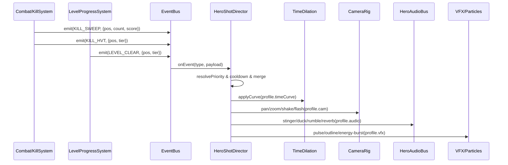
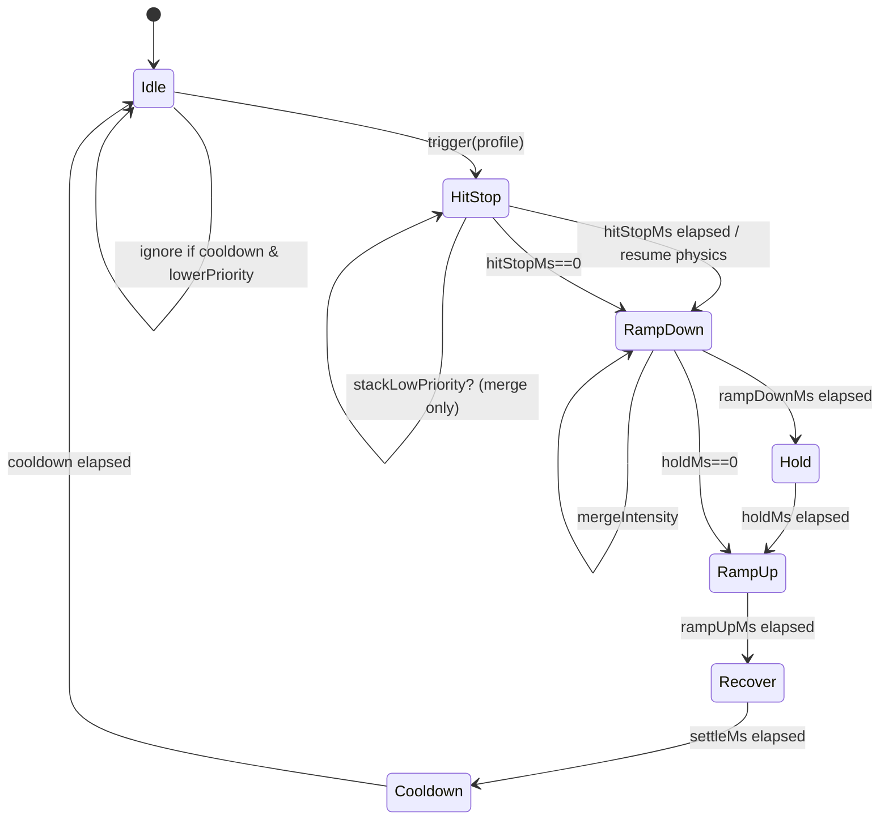

# Phaser3 中实现超高质感英雄镜头效果的深度研究报告：时间缓动、镜头运动、声音处理一体化

## 执行摘要

“英雄镜头（hero shot）反馈时刻”本质上是把一瞬间的战斗结果（扫荡击杀、高价值目标击杀、通关吞食）扩展成可感知、可记忆、可预测的多通道信号：视觉上的时间拉伸与聚焦、镜头动势的“身体感”、声音的瞬态与低频权威感共同协作。学术研究对“impact feel（冲击手感）”的梳理指出：**hit stop（打击停顿）、声音一致性（sound coherence）、镜头控制（camera control）**是影响玩家冲击体验的关键要素之一，缺少其中任何一项都可能显著削弱体验。citeturn10view0

结合你的设计简报：本作是俯视角、超快节奏、几何、强动势、短局递进；通关吞食晋级目标需要“极强正反馈”：结构短暂发亮、脉冲加速、能量暴涨、镜头轻微前冲、背景短时变化，并且节奏要快、重开要快。fileciteturn0file0L1-L1 因此推荐把“英雄镜头”拆成两层产品化能力：  
第一层是**高频微英雄（Micro Hero）**：短促 hit-stop + 小幅镜头 punch + 瞬态冲击音（不打断节奏）；第二层是**低频宏英雄（Macro Hero）**：短时间速度坡（speed ramp）+ 镜头前冲/缩放构图 + 音乐duck与尾音空间化（用于高价值击杀、关卡通关）。

在 Phaser3 的可落地实现上，本报告给出：  
一套“HeroShotDirector（英雄镜头导演）”架构（事件触发→状态机编排→时间尺度/镜头/音频三路总线同步），并提供三套可直接拷贝的**Light / Medium / Heavy**预设参数与代码片段；同时给出效果冲突优先级规则、时序对齐点、资产制作规格与 A/B 调参方法。Phaser3 侧将主要依赖：Arcade World 的 `timeScale` 与 `pause()`、Time Clock 的 `timeScale`、TweenManager 的 `timeScale`、AnimationManager 的 `globalTimeScale`、ParticleEmitter 的 `timeScale`、Camera 的 `shake/pan/zoomTo/flash`、以及 WebAudioSound(WebAudio) 的 `rate/detune` 与 WebAudioSoundManager 的 `AudioContext` 与主增益节点。citeturn14view0turn3search2turn11search2turn3search3turn12search12turn5view0turn5view1turn5view2turn5view3turn4view0turn15view0

假设说明：你未限定分辨率、平台与帧率。本报告按 **Web 平台（Phaser 默认定位）、目标 60fps，但支持帧率波动** 的工程假设给出实现；所有关键参数都以“毫秒 + 曲线”描述，避免与帧率强绑定。

## 理论与感知原则：时间缓动、镜头动势、声音冲击如何“合成质感”

### 冲击手感的三支柱与“协同一致性”

“冲击手感”不是任一单点特效，而是三类反馈的协同：时间（hit-stop/slow-mo）、镜头控制（构图变化 + 抖动/前冲）、声音一致性（瞬态、音色、时基变化一致）。对 action game 评论与特征框架的研究指出：hit stop、sound coherence、camera control 对 impact feel 有显著影响，缺失会导致冲击体验不佳。citeturn10view0

这对你的“几何+纯色主体”风格尤其重要：当材质细节少时，**动势与节奏的结构性线索**（时间尺度变化、镜头构图变化、瞬态声音）会成为主要“质感来源”。

### 时间缓动的三种基本语法：hit-stop、slow-mo、speed-ramp

Hit-stop（也称 hitlag/hitfreeze）是“在碰撞瞬间冻结/几乎冻结动作”的时间语法，常用于增强打击的力量感。其机制与体验已在多个研究与实践讨论中被反复提及：通过短暂停止/延迟来增强冲击与主观掌控感（agency）。citeturn8search26turn10view0  
更进一步，有研究通过主观评价实验分析 pleasant/unpleasant 的 hit stop 区间边界：在其具体实验场景里，pleasant 与 unpleasant 分布均值与边界线可量化到约 0.53–0.55 秒附近（不同场景略有差异）。citeturn9view0  
但要注意：该论文使用的任务与游戏节奏、武器语境与本作不同，它给出的数值更适合作为“上界与语境敏感性证据”，而不是你这种超快节奏街机游戏的直接默认值。对你而言，更应采用**“微停顿（20–60ms 级别）+ 可频繁触发”**作为常态，把更长的时间变化留给低频宏英雄时刻。

Slow-mo（子弹时间）与 speed-ramp（速度坡/时间重映射）属于更“电影化”的语法：它们强调“把结果拉长、让眼睛来得及理解”。在节奏极快的游戏里，推荐使用**短持有（hold 很短）+ 迅速回弹**，避免切断操作流。

核心原则：  
时间变化必须是“缓动曲线”，而不是阶跃。因为阶跃会让玩家感到“系统卡顿/bug”，而缓动会被解释为“导演感/冲击”。曲线的设计要满足：  
其一，**下降段快**（让冲击立即成立）；其二，**回升段更快但可带轻微 overshoot**（让释放更爽）；其三，全程总时长不要破坏你文档里强调的高频循环（你的小循环希望 5–12 秒完整经历一次）。fileciteturn0file0L1-L1

### 镜头运动：从“随机抖”升级到“可控动势”

Vlambeer 的 “juice” 思想与屏幕抖动（screen shake）实践反复强调：通过大量细小反馈放大交互意义。citeturn0search15turn1search5  
而“镜头抖动”本身也有从“随机抖”进化到“基于创伤（trauma）的衰减曲线 + 相干噪声”的成熟范式：GDC 的《Juicing Your Cameras With Math》专门系统化了相机行为、平滑运动与抖动的数学方法，并被许多实现框架引用为“trauma 驱动抖动”的来源。citeturn6search0turn6search7turn6search15

对你的英雄镜头，镜头运动建议按“层级”组织（由轻到重叠加）：  
第一层是**构图层**：pan/zoom（你称“轻微前冲”本质是“pan 到事件点 + zoom in”）；第二层是**冲击层**：短 shake 与 flash；第三层是**聚焦层**：短时背景变化（暗角/vignette、轻微色彩偏移或整体对比变化），把注意力强制锁定到“吞食/爆发”中心。Phaser 的相机 API 直接支持 `shake/pan/zoomTo/flash`，并且这些效果都有 duration/intensity/ease 等参数。citeturn5view0turn5view1turn5view2turn5view3

### 声音处理：瞬态、低频、空间尾音与时间基一致

Phaser 在支持 Web Audio API 时，会使用 WebAudioSoundManager；并暴露 `AudioContext` 与 master gain 节点，允许你构建更高级的音频处理图。citeturn22search19turn15view0  
在 hero shot 中，“高级质感”通常来自四个处理方向：  

其一，**瞬态冲击（transient）**：用短促、硬边、上升沿极快的层（click / snap / tick）让大脑立刻判定“发生了撞击”。  
其二，**低频权威感（rumble/LFE）**：用 30–80Hz 的短促能量包络（可以采样，也可以用振荡器合成）建立“重量”。Web Audio 的 OscillatorNode 可生成稳定波形；GainNode 可做包络；BiquadFilterNode 可做低通塑形。citeturn18search0turn18search3turn18search1  
其三，**空间尾音（reverb/delay）**：用短混响/短延迟把“冲击”粘在空间中。Web Audio 的 ConvolverNode 常用于卷积混响；DelayNode 用于延迟线效果。citeturn2search2turn18search14  
其四，**时间基一致（pitch/rate 与视觉时间同向变化）**：当你做 slow-mo 或 speed-ramp 时，至少要让“音乐或关键 SFX”做轻微 rate/ detune 的同向变化，否则会出现“画面慢了、声音没慢”的割裂感（sound coherence 被破坏）。Phaser 的 WebAudioSound 支持 `rate`（播放速率）与 `detune`（音分 cents），并提供 `setRate/setDetune`。citeturn4view0

补充：严格意义上的“变速不变调（time-stretch without pitch shift）”在 WebAudio 原生并不直接提供，需要更复杂的 DSP（相位声码器、WSOLA 等），属于 DAFX 这类“时间分段/时频处理”的专门主题。citeturn2search3 在超快节奏街机游戏里，实践上更常用“轻微降速即降调”的电影化手法，反而更符合玩家对 slow-mo 的预期。

## Phaser3 端的系统架构与实现要点：把“英雄镜头”做成可复用产品能力

### 推荐架构：事件驱动 + 导演系统 + 三路总线同步

将 hero shot 视作“导演系统（Director）”而不是散落在各处的特效调用。逻辑上它是一个**有限状态机 + 参数配置 + 冲突仲裁器**。

关键分层如下：  
Gameplay（击杀、连杀、关卡完成）只负责发事件；HeroShotDirector 负责编排；TimeDilation、CameraRig、AudioBus、VFXBus 四个子系统只提供“可被调度的动作”。

下面是事件流（Mermaid sequence diagram）：



### 时间系统：统一“直觉 timeScale”，再映射到 Phaser 各子系统

Phaser 的各模块对“时间尺度”的定义并不完全一致：  
Arcade Physics World 的 `timeScale` 是“作用在 frame rate 的缩放因子”，其文档给出示例：`1.0=正常`、`2.0=半速`、`0.5=双倍速`。citeturn14view0  
同时，Arcade World 的 `fixedStep` 为 false 时会禁用 fps 与 timeScale。citeturn14view0

而 Phaser.Time.Clock 的 `timeScale` 是“缩放 clock delta”，`0` 等价于冻结该 Clock。citeturn3search2  
TweenManager 的 `timeScale` 同样是“缩放 tween delta，影响该管理器拥有的所有 tweens”。citeturn11search2  
AnimationManager 的 `globalTimeScale` 会缩放动画系统的 delta。citeturn3search3  
ParticleEmitter 的 `timeScale` 会影响粒子寿命、移动与 tween。citeturn12search12

因此建议：  
你在游戏中定义**一个直觉变量** `dilation`：  
`dilation = 1` 正常；`dilation < 1` 慢动作；`dilation = 0` hit-stop（或近似 0）。  
然后做映射：  
`physics.world.timeScale = (dilation == 0 ? VERY_LARGE : 1 / dilation)`（因为它是“2.0=半速”的反向语义）。citeturn14view0  
`scene.time.timeScale = dilation`（定时器随游戏时间走）citeturn3search2  
`scene.tweens.timeScale = dilation`citeturn11search2  
`scene.anims.globalTimeScale = dilation`citeturn3search3  
粒子：对关键 emitter 设置 `emitter.timeScale = dilation` 或在 hero shot 期间对“背景粒子”保持 1，让焦点粒子随时间慢下来形成层次。citeturn12search12

Hit-stop 的“最干净实现”是：暂停物理模拟但继续渲染与音频。Arcade World 提供 `pause()`：暂停模拟，不更新 body 与 collider，但依然可以启用/禁用 body 或手动做碰撞检查。citeturn3search12  
这非常适合做 30–60ms 级别的 hit-stop。

### 镜头系统：优先使用 Camera 内建 FX，再补“trauma 抖动”与“聚焦 PostFX”

Phaser Camera 提供：  
`shake(duration=100, intensity=0.05, force=false, callback)`citeturn5view0  
`pan(x, y, duration=1000, ease='Linear', force=false, callback)`citeturn5view2  
`zoomTo(zoom, duration=1000, ease='Linear', force=false, callback)`citeturn5view1  
`flash(duration=250, r=255, g=255, b=255, force=false)`citeturn5view3  

另外，如果你使用 `startFollow`，文档提醒跟随时可能出现 sub-pixel 抖动；通过 `roundPixels=true` 或保持整数 zoom 可以减少 jitter。citeturn5view0  
这对“高速几何游戏”很关键：hero shot 的镜头运动必须是“稳的”，否则会被当成渲染瑕疵。

更高级（可选）的“聚焦”效果：用 vignette、轻微 blur 或色相偏移把背景压下去。Phaser 的 Post FX Pipeline 用于后处理，可用于 bloom/blur/color manipulation 等。citeturn17search3 但它们**仅 WebGL 可用**，需要为低端设备准备降级方案。citeturn17search5turn17search8  
Phaser 也提供内建的 VignetteFXPipeline，用于暗角聚焦。citeturn17search18

### 声音系统：Phaser Sound API + Web Audio 图形化总线

Phaser 的音频系统会自动检测 Web Audio 支持并使用它，否则 fallback 到 Audio Tag，因此你能用同一套 API 播放音频。citeturn22search19turn6search33  
在 Web Audio 模式下：WebAudioSoundManager 暴露 `context: AudioContext`、`masterVolumeNode: GainNode`、`masterMuteNode: GainNode`，便于你挂接自己的效果 bus。citeturn15view0  
每个 WebAudioSound 也暴露 `rate/detune`、`volumeNode: GainNode` 等。citeturn4view0turn16view0

关键实现建议：  
把“英雄镜头音频”独立成一个 `heroBus`（GainNode），并把它 connect 到 `soundManager.masterVolumeNode`。这样 hero shot 的 stinger/rumble/reverb 不会污染普通 SFX 的 mix，还能统一做 duck/limiter。

Duck（音乐压低）建议用 AudioParam 的时间调度方法（线性或指数 ramp），避免突变。MDN 明确介绍了 `AudioParam.linearRampToValueAtTime()` 与 `setTargetAtTime()` 在淡入淡出、ADSR 包络中的用途。citeturn21search0turn21search5turn21search29

## 可参数化实现配方与预设：从效果对比表到可直接用的 Phaser3 代码

### 效果变体对比表：slow-mo vs hit-stop vs speed-ramp（含参数、镜头与音频链）

下表给出三种“英雄镜头时间语法”的推荐参数范围（偏街机超快节奏），并把镜头与音频的同步处理一起列出。CPU/GPU 成本为**经验性等级**（Low/Med/High），用于你在设备分层时做取舍。

| 变体 | 总时长（ms） | 时间尺度曲线（示例） | 镜头范围（示例） | 音频处理（示例） | CPU/GPU 成本 | 推荐使用场景 |
|---|---:|---|---|---|---|---|
| Hit-stop 微停顿 | 20–60 | `dilation=0`（或极小）保持 20–60ms；随后瞬间回到 1 | `shake` 80–140ms，intensity 0.01–0.03；可选 `flash` 40–90ms | 播放 1 个“click+thump”冲击；轻微 `duck` 3–6dB 150–250ms；可选 stinger 极短 | Low | 高频：普通击杀、连续命中、扫荡连斩的“每一刀都爽” |
| Slow-mo 短持有 | 250–520 | 下降段 60–120ms 到 `dilation=0.2–0.45`；hold 80–180ms；回升 120–220ms | `zoomTo` +0.04–+0.10；`pan` 0–120px；轻 `shake` 120–200ms | 音乐 `duck` 6–9dB；音乐 `rate` 0.90–0.97；加短混响 send | Med（音频更多） | 中频：击杀高价值目标、连杀达成、角色爆发姿态进入（“你进入狩猎态/爆发态”） |
| Speed-ramp（含 overshoot） | 350–750 | 40ms hit-stop → 下降到 `dilation=0.10–0.25`（80–140ms）→ hold（80–160ms）→ 回升到 `1.05`（80–160ms）→ settle 到 1（120–220ms） | `zoomTo` +0.08–+0.18（带回弹）；`pan` 80–220px；`shake` 180–320ms；背景 vignette 250–600ms | stinger（短旋律/噪声上扬）+ 低频 rumble（30–80Hz）+ `duck` 8–12dB；可选 delay slapback 40–90ms | Med–High（若启用 PostFX/卷积混响更高） | 低频：关卡通关吞食晋级目标、Boss-like 高压目标吞食完成、极端扫荡（屏幕清空） |

（Phaser 支持该表中的关键动作：Camera 的 `shake/pan/zoomTo/flash`；Arcade World 的 `timeScale/pause`；Clock/Tween/Anims/Particles 的 timeScale；WebAudioSound 的 rate/detune；WebAudioSoundManager 的 AudioContext 与 master gain。citeturn5view0turn5view1turn5view2turn5view3turn14view0turn3search12turn3search2turn11search2turn3search3turn12search12turn4view0turn15view0）

### 核心数据结构：HeroShotProfile（参数即产品）

下面用 TypeScript 风格定义一个 profile。重点：**所有时间均以 real time（墙钟时间）推进**，避免“慢动作把导演系统自己也拖慢”的递归问题。

```ts
// 直觉时间尺度：1=正常，<1=慢动作，0=停顿
type TimeCurve = {
  hitStopMs: number;          // 0..80
  rampDownMs: number;         // 0..200
  holdMs: number;             // 0..300
  rampUpMs: number;           // 0..250
  settleMs: number;           // 0..250
  minDilation: number;        // 0.05..0.6
  overshootDilation: number;  // 1.0..1.12 (可选)
};

type CameraPunch = {
  // 注意：Phaser Camera.zoomTo/pan 的 duration/ease 直接可用
  zoomPeak: number;           // 相对当前 zoom 的乘数，比如 1.12
  zoomInMs: number;
  zoomOutMs: number;
  zoomEaseIn: string;         // 'Sine.easeOut' 等
  zoomEaseOut: string;

  panToEvent: boolean;
  panMs: number;
  panEase: string;
  panMaxOffsetPx: number;     // 事件点“前冲”距离（沿玩家朝向或冲击方向）

  shakeMs: number;
  shakeIntensity: number;     // 0..0.08（Camera.shake 的 intensity）
  flashMs: number;            // 0 禁用
  flashRGB: [number, number, number];
};

type AudioPunch = {
  stingerKey?: string;        // 例如 'stinger_heavy_01'
  impactKey?: string;         // 例如 'impact_heavy_03'
  duckDb: number;             // -3..-12
  duckAttackMs: number;       // 5..30
  duckHoldMs: number;         // 80..400
  duckReleaseMs: number;      // 80..350

  musicRate?: number;         // 0.85..1.0（可选）
  sfxRate?: number;           // 0.85..1.05（可选）

  rumbleHz?: number;          // 30..80（可选）
  rumbleMs?: number;          // 120..500
  rumbleGain?: number;        // 0..1（建议 0.05..0.35）
  rumbleLowpassHz?: number;   // 80..200

  // 可选：短混响/延迟 send（若你接了 WebAudio 的 Convolver/Delay）
  reverbSend?: number;        // 0..1
  slapDelayMs?: number;       // 0..120
};

export type HeroShotProfile = {
  name: 'light' | 'medium' | 'heavy';
  priority: number;           // 冲突仲裁
  cooldownMs: number;         // 防止刷屏
  time: TimeCurve;
  cam: CameraPunch;
  audio: AudioPunch;
};
```

### Phaser3 导演系统：HeroShotDirector（状态机 + 三路同步）

实现要点：  
1) Director 用**真实 delta（update 里拿到的 delta）**推进自身时间轴；  
2) Director 在每帧把 `dilation` 映射到 World/Clock/Tween/Animation/Particles；  
3) Hit-stop 用 `physics.world.pause()` 更“干净”；恢复后再启用慢动作曲线（如果需要）。citeturn3search12turn14view0

```ts
class HeroShotDirector {
  private scene: Phaser.Scene;
  private cam: Phaser.Cameras.Scene2D.Camera;
  private active: boolean = false;

  private elapsedMs = 0;
  private profile!: HeroShotProfile;

  private baseZoom = 1;
  private eventPos = new Phaser.Math.Vector2();
  private panVec = new Phaser.Math.Vector2();

  // 直觉 time dilation
  private dilation = 1;

  constructor(scene: Phaser.Scene) {
    this.scene = scene;
    this.cam = scene.cameras.main;
  }

  trigger(profile: HeroShotProfile, worldX: number, worldY: number, dirX = 0, dirY = -1) {
    // 冲突仲裁：在外部调用前先做 priority/cooldown（见后文）
    this.profile = profile;
    this.elapsedMs = 0;
    this.active = true;

    this.baseZoom = this.cam.zoom;
    this.eventPos.set(worldX, worldY);

    // “前冲向量”：沿冲击方向（或玩家朝向）推一个偏移
    this.panVec.set(dirX, dirY).normalize();
    if (this.panVec.lengthSq() < 1e-5) this.panVec.set(0, -1);

    // 立即启动镜头与音频（t=0）
    this.startCameraFX();
    this.startAudioFX();

    // hit-stop：先暂停物理（最稳）
    const hs = this.profile.time.hitStopMs;
    if (hs > 0) {
      this.scene.physics.world.pause(); // Arcade World.pause() 会暂停模拟citeturn3search12
    }
  }

  update(deltaMs: number) {
    if (!this.active) return;

    this.elapsedMs += deltaMs;

    const t = this.profile.time;

    // 1) 处理 hit-stop 阶段
    if (t.hitStopMs > 0 && this.elapsedMs >= t.hitStopMs && this.scene.physics.world.isPaused) {
      this.scene.physics.world.resume();
    }

    // 2) 计算时间尺度曲线（以 real time 为自变量）
    this.dilation = this.evalDilation(this.elapsedMs, t);

    // 3) 应用到 Phaser 各子系统
    this.applyTimeDilation(this.dilation);

    // 4) 结束条件：曲线尾部结束后恢复
    const total = t.hitStopMs + t.rampDownMs + t.holdMs + t.rampUpMs + t.settleMs;
    if (this.elapsedMs >= total) {
      this.cleanup();
    }
  }

  private evalDilation(ms: number, t: TimeCurve): number {
    const hs = t.hitStopMs;
    if (ms < hs) return 0;

    const local = ms - hs;
    const d0 = 1;
    const dMin = t.minDilation;

    // 分段：down -> hold -> up(overshoot) -> settle
    if (local < t.rampDownMs) {
      const p = local / Math.max(1, t.rampDownMs);
      return Phaser.Math.Linear(d0, dMin, easeOutCubic(p));
    }
    const a = local - t.rampDownMs;

    if (a < t.holdMs) return dMin;

    const b = a - t.holdMs;
    const dOver = t.overshootDilation;

    if (b < t.rampUpMs) {
      const p = b / Math.max(1, t.rampUpMs);
      return Phaser.Math.Linear(dMin, dOver, easeInOutQuad(p));
    }
    const c = b - t.rampUpMs;

    if (c < t.settleMs) {
      const p = c / Math.max(1, t.settleMs);
      return Phaser.Math.Linear(dOver, 1, easeOutCubic(p));
    }
    return 1;
  }

  private applyTimeDilation(dilation: number) {
    // Arcade World.timeScale 是“2=半速，0.5=双倍速”的语义citeturn14view0
    // 让 dilation 保持直觉：0.5=半速，所以 world.timeScale = 1 / dilation
    const world = this.scene.physics.world;
    if (!world.fixedStep) {
      // fixedStep=false 会禁用 fps/timeScale（建议在 config 中启用 fixedStep）citeturn14view0
    } else {
      const safe = Math.max(0.001, dilation);
      world.timeScale = 1 / safe;
    }

    // Clock / Tweens / Anims / Particles
    this.scene.time.timeScale = dilation;           // Clock.timeScale 可冻结citeturn3search2
    this.scene.tweens.timeScale = dilation;         // TweenManager.timeScale 影响所有 tweensciteturn11search2
    this.scene.anims.globalTimeScale = dilation;    // globalTimeScaleciteturn3search3

    // 粒子：建议只对“主体/焦点粒子”应用 dilation，背景保持 1（层次感）
    // emitter.timeScale = dilation;                // ParticleEmitter.timeScaleciteturn12search12
  }

  private startCameraFX() {
    const c = this.profile.cam;

    // 计算 pan 目标点：事件点 + 前冲偏移
    let tx = this.eventPos.x;
    let ty = this.eventPos.y;
    if (c.panToEvent) {
      tx += this.panVec.x * c.panMaxOffsetPx;
      ty += this.panVec.y * c.panMaxOffsetPx;
      this.cam.pan(tx, ty, c.panMs, c.panEase, true); // Camera.panciteturn5view2
    }

    // zoom punch
    const z = this.baseZoom * c.zoomPeak;
    this.cam.zoomTo(z, c.zoomInMs, c.zoomEaseIn, true); // Camera.zoomTociteturn5view1
    // 在 zoomOutMs 后回弹（不用 tween，直接延迟用 setTimeout/自管计时）
    if (c.zoomOutMs > 0) {
      const backDelay = c.zoomInMs;
      this.scene.time.delayedCall(backDelay, () => {
        this.cam.zoomTo(this.baseZoom, c.zoomOutMs, c.zoomEaseOut, true);
      });
    }

    // shake + flash
    if (c.flashMs > 0) {
      const [r, g, b] = c.flashRGB;
      this.cam.flash(c.flashMs, r, g, b, true); // Camera.flashciteturn5view3
    }
    if (c.shakeMs > 0 && c.shakeIntensity > 0) {
      this.cam.shake(c.shakeMs, c.shakeIntensity, true); // Camera.shakeciteturn5view0
    }
  }

  private startAudioFX() {
    // 这里先用 Phaser Sound（stinger/impact）+ 外部 HeroAudioBus 做 duck/rumble
    // Phaser WebAudioSound 支持 rate / detune / volumeNode 等citeturn4view0turn16view0
    const a = this.profile.audio;

    if (a.stingerKey) this.scene.sound.play(a.stingerKey);
    if (a.impactKey) this.scene.sound.play(a.impactKey);

    // Duck / rumble / reverb 见后文 HeroAudioBus 示例
  }

  private cleanup() {
    this.active = false;
    this.elapsedMs = 0;

    // 恢复所有 time scale
    this.applyTimeDilation(1);

    // 保底恢复镜头
    this.cam.zoomTo(this.baseZoom, 80, 'Sine.easeOut', true);
  }
}

function easeOutCubic(t: number) { return 1 - Math.pow(1 - t, 3); }
function easeInOutQuad(t: number) { return t < 0.5 ? 2*t*t : 1 - Math.pow(-2*t+2, 2)/2; }
```

上面代码依赖的 Phaser 能力都来自官方文档：Camera 的 `shake/pan/zoomTo/flash` citeturn5view0turn5view1turn5view2turn5view3、Arcade World 的 `pause()` citeturn3search12 与 `timeScale` 语义 citeturn14view0、Clock/Tweens/Anims 的 timeScale/globalTimeScale citeturn3search2turn11search2turn3search3、ParticleEmitter 的 timeScale citeturn12search12。

### 三套可直接用的预设：Light / Medium / Heavy（精确数值 + 推荐场景）

把预设当成“可移植产品”，你可以按事件类型直接映射：  
- sweeping kills → light（可高频）  
- high-value kill → medium  
- level clear / 晋级目标吞食 → heavy（低频、演出更完整）fileciteturn0file0L1-L1

#### 预设参数表

| 预设 | priority | cooldown | hitStop | minDilation | rampDown / hold / rampUp / settle | zoomPeak | panOffset | shake(ms,intensity) | flash | duck(dB) | rumble |
|---|---:|---:|---:|---:|---|---:|---:|---|---|---:|---|
| light | 10 | 180ms | 30ms | 0.70 | 60 / 0 / 90 / 80 | 1.05 | 50px | 120ms, 0.015 | 50ms 白 | -4dB | 无 |
| medium | 20 | 450ms | 40ms | 0.38 | 90 / 120 / 140 / 140 | 1.10 | 120px | 200ms, 0.025 | 70ms 白偏青 | -7dB | 45Hz, 240ms, 0.18 |
| heavy | 30 | 1200ms | 50ms | 0.16 | 120 / 140 / 160 / 200（含 1.06 overshoot） | 1.18 | 200px | 320ms, 0.035 | 90ms 白偏红 | -10dB | 40Hz, 360ms, 0.28 + 低通 |

这些数值是面向“快节奏街机几何”风格的默认起点：hit-stop 足够短以免打断操作链；heavy 才使用更强的 zoom/pan 与更重的 duck/rumble，让“层级吞食”的意义成立。fileciteturn0file0L1-L1

#### Phaser3 代码：三预设定义 + 触发示例

```ts
const HERO_PRESETS: Record<string, HeroShotProfile> = {
  light: {
    name: 'light',
    priority: 10,
    cooldownMs: 180,
    time: {
      hitStopMs: 30,
      rampDownMs: 60,
      holdMs: 0,
      rampUpMs: 90,
      settleMs: 80,
      minDilation: 0.70,
      overshootDilation: 1.00,
    },
    cam: {
      zoomPeak: 1.05,
      zoomInMs: 60,
      zoomOutMs: 120,
      zoomEaseIn: 'Sine.easeOut',
      zoomEaseOut: 'Sine.easeOut',
      panToEvent: false,
      panMs: 0,
      panEase: 'Linear',
      panMaxOffsetPx: 50,
      shakeMs: 120,
      shakeIntensity: 0.015,
      flashMs: 50,
      flashRGB: [255, 255, 255],
    },
    audio: {
      impactKey: 'impact_light_01',
      duckDb: -4,
      duckAttackMs: 10,
      duckHoldMs: 120,
      duckReleaseMs: 140,
      sfxRate: 0.98,
    },
  },

  medium: {
    name: 'medium',
    priority: 20,
    cooldownMs: 450,
    time: {
      hitStopMs: 40,
      rampDownMs: 90,
      holdMs: 120,
      rampUpMs: 140,
      settleMs: 140,
      minDilation: 0.38,
      overshootDilation: 1.02,
    },
    cam: {
      zoomPeak: 1.10,
      zoomInMs: 90,
      zoomOutMs: 180,
      zoomEaseIn: 'Cubic.easeOut',
      zoomEaseOut: 'Cubic.easeOut',
      panToEvent: true,
      panMs: 160,
      panEase: 'Quad.easeOut',
      panMaxOffsetPx: 120,
      shakeMs: 200,
      shakeIntensity: 0.025,
      flashMs: 70,
      flashRGB: [220, 255, 255],
    },
    audio: {
      stingerKey: 'stinger_med_01',
      impactKey: 'impact_med_02',
      duckDb: -7,
      duckAttackMs: 12,
      duckHoldMs: 240,
      duckReleaseMs: 220,
      musicRate: 0.93,
      rumbleHz: 45,
      rumbleMs: 240,
      rumbleGain: 0.18,
      rumbleLowpassHz: 140,
      reverbSend: 0.25,
      slapDelayMs: 60,
    },
  },

  heavy: {
    name: 'heavy',
    priority: 30,
    cooldownMs: 1200,
    time: {
      hitStopMs: 50,
      rampDownMs: 120,
      holdMs: 140,
      rampUpMs: 160,
      settleMs: 200,
      minDilation: 0.16,
      overshootDilation: 1.06,
    },
    cam: {
      zoomPeak: 1.18,
      zoomInMs: 120,
      zoomOutMs: 260,
      zoomEaseIn: 'Expo.easeOut',
      zoomEaseOut: 'Cubic.easeOut',
      panToEvent: true,
      panMs: 220,
      panEase: 'Cubic.easeOut',
      panMaxOffsetPx: 200,
      shakeMs: 320,
      shakeIntensity: 0.035,
      flashMs: 90,
      flashRGB: [255, 235, 235],
    },
    audio: {
      stingerKey: 'stinger_heavy_01',
      impactKey: 'impact_heavy_03',
      duckDb: -10,
      duckAttackMs: 8,
      duckHoldMs: 340,
      duckReleaseMs: 320,
      musicRate: 0.88,
      rumbleHz: 40,
      rumbleMs: 360,
      rumbleGain: 0.28,
      rumbleLowpassHz: 110,
      reverbSend: 0.35,
      slapDelayMs: 80,
    },
  }
};

// 触发示例：杀死高价值目标
eventBus.on('KILL_HVT', ({ x, y, dirX, dirY }) => {
  heroDirector.trigger(HERO_PRESETS.medium, x, y, dirX, dirY);
});

// 触发示例：关卡通关吞食晋级目标
eventBus.on('LEVEL_CLEAR', ({ x, y, dirX, dirY }) => {
  heroDirector.trigger(HERO_PRESETS.heavy, x, y, dirX, dirY);
});
```

### HeroAudioBus：用 Web Audio 做 duck、rumble、短延迟/混响（可选，但质感提升明显）

Phaser WebAudioSoundManager 暴露 `context` 与 `masterVolumeNode`，你可以把自建节点挂到 masterVolumeNode 上。citeturn15view0  
Web Audio API 本质是模块化路由：选择音源、添加效果、进行空间化。citeturn18search31

下面给一个“足够实战、成本可控”的 HeroAudioBus：  
- duck：直接操作 music sound 的 `volumeNode.gain`（或你也可以全局做一个 musicBus）citeturn16view0turn18search3  
- rumble：Oscillator + Gain 包络 + Lowpass citeturn18search0turn18search1turn18search3  
- delay：简单 slapback（短延迟）citeturn18search14  
- reverb：ConvolverNode（注意卷积混响偏重，移动端可降级为 delay + filter 或直接用带尾音的采样）citeturn2search2  
- 参数自动化：用 `AudioParam.linearRampToValueAtTime()` / `setTargetAtTime()` 做平滑变化。citeturn21search0turn21search5turn21search29

```ts
class HeroAudioBus {
  private ctx: AudioContext;
  private masterIn: GainNode;    // 连接到 Phaser masterVolumeNode
  private heroGain: GainNode;

  private rumbleFilter: BiquadFilterNode;
  private rumbleGain: GainNode;

  private delay?: DelayNode;
  private delayGain?: GainNode;

  constructor(phaserSoundManager: Phaser.Sound.WebAudioSoundManager) {
    this.ctx = phaserSoundManager.context;                 // AudioContextciteturn15view0
    this.masterIn = phaserSoundManager.masterVolumeNode;   // GainNodeciteturn15view0

    this.heroGain = this.ctx.createGain();
    this.heroGain.gain.value = 1.0;
    this.heroGain.connect(this.masterIn);

    // rumble chain: osc -> rumbleGain -> lowpass -> heroGain
    this.rumbleGain = this.ctx.createGain();
    this.rumbleGain.gain.value = 0;

    this.rumbleFilter = this.ctx.createBiquadFilter(); // BiquadFilterNodeciteturn18search1
    this.rumbleFilter.type = 'lowpass';
    this.rumbleFilter.frequency.value = 140;

    this.rumbleGain.connect(this.rumbleFilter);
    this.rumbleFilter.connect(this.heroGain);
  }

  duckMusic(music: Phaser.Sound.WebAudioSound, duckDb: number, atkMs: number, holdMs: number, relMs: number) {
    // WebAudioSound.volumeNode 是 GainNodeciteturn16view0turn18search3
    const g = music.volumeNode.gain;
    const now = this.ctx.currentTime;

    const target = dbToGain(duckDb); // duckDb 为负值，如 -10dB
    const atk = atkMs / 1000;
    const hold = holdMs / 1000;
    const rel = relMs / 1000;

    // 采用线性 ramp：MDN 提供 linearRampToValueAtTime 用于 gain 淡入淡出citeturn21search0
    g.cancelScheduledValues(now);
    g.setValueAtTime(g.value, now);                               // setValueAtTime 精确调度citeturn21search10
    g.linearRampToValueAtTime(target, now + atk);
    g.linearRampToValueAtTime(target, now + atk + hold);
    g.linearRampToValueAtTime(1.0,   now + atk + hold + rel);
  }

  playRumble(freqHz: number, ms: number, gain: number, lowpassHz: number) {
    const osc = this.ctx.createOscillator(); // OscillatorNodeciteturn18search0
    osc.type = 'sine';
    osc.frequency.value = freqHz;

    this.rumbleFilter.frequency.value = lowpassHz;

    const now = this.ctx.currentTime;
    const dur = ms / 1000;

    const g = this.rumbleGain.gain;
    g.cancelScheduledValues(now);
    g.setValueAtTime(0.0001, now);
    g.linearRampToValueAtTime(gain, now + 0.02);        // 20ms attack
    g.setTargetAtTime(0.0001, now + dur * 0.35, 0.12);  // setTargetAtTime 适合 decay/releaseciteturn21search5

    osc.connect(this.rumbleGain);
    osc.start(now);
    osc.stop(now + dur);
  }

  ensureSlapDelay(delayMs: number) {
    if (delayMs <= 0) return;
    if (this.delay) return;

    this.delay = this.ctx.createDelay(0.2); // DelayNode 由 createDelay 创建citeturn18search2turn18search14
    this.delayGain = this.ctx.createGain();
    this.delayGain.gain.value = 0.22;

    // heroGain 分一路到 delay，再回混到 heroGain
    this.heroGain.connect(this.delay);
    this.delay.connect(this.delayGain);
    this.delayGain.connect(this.heroGain);
  }

  setSlapDelay(delayMs: number) {
    if (!this.delay) return;
    this.delay.delayTime.value = Math.min(0.12, Math.max(0.01, delayMs / 1000));
  }
}

function dbToGain(db: number) {
  return Math.pow(10, db / 20); // db=-6 => ~0.501
}
```

适配 Phaser：  
- 你的背景音乐建议用 `const music = this.sound.add('bgm') as Phaser.Sound.WebAudioSound;` 保存引用。WebAudioSoundManager 与 WebAudioSound 的类型与字段在文档中公开（context、masterVolumeNode、volumeNode、rate、detune 等）。citeturn15view0turn16view0turn4view0  
- hero shot 触发时：`audioBus.duckMusic(music, -10, 8, 340, 320)`；并在 heavy/medium 下调用 `playRumble(...)`。

## 时间编排与冲突管理：时序、缓动曲线、音画同步点、叠加规则

### HeroShotDirector 状态机（Mermaid）



设计要点：  
- **优先级（priority）**：LEVEL_CLEAR > KILL_HVT > KILL_SWEEP。低优先级在高优先级期间只能“合并强度”而不能重启整套演出。  
- **冷却（cooldown）**：light 很短（180ms）允许连续爽点；heavy 冷却长（1.2s）防止“通关还没结束又被下一次触发打断”。  
- **合并规则**：shake/flash/rumble 可以叠加为“取 max”；pan/zoom/timeScale 不建议叠加，建议由最高优先级独占控制。

### 音画同步的关键对齐点（你最该死盯的 6 个点）

对齐点不是“同时发生”，而是“感知上同时”。推荐规则（以 t=0 为触发瞬间）：

1) **t=0：瞬态 click/impact** 必须最早到（甚至可领先画面 0–1 帧），让大脑先做“发生了”的判定。  
2) **t=0：hit-stop**（若启用）最好与 impact 同帧，形成“卡住这一拳”的力量感。Arcade World.pause() 可实现。citeturn3search12  
3) **t=0~60ms：zoom/pan 的向内趋势**要出现（哪怕幅度小），对应你简报里的“镜头轻微前冲”。fileciteturn0file0L1-L1  
4) **t=40~120ms：flash**非常短（40–90ms），用于“吞食/爆发”的读秒式强调。Camera.flash 支持快速闪白。citeturn5view3  
5) **t=80~300ms：rumble 与尾音**开始承担“重量与空间”，而不是继续堆瞬态。Oscillator + filter + envelope 就能做到成本可控的 rumble。citeturn18search0turn18search1turn21search5  
6) **回弹段（RampUp/Recover）：音乐与镜头一起回**。镜头回弹的 overshoot（例如 dilation 到 1.06 再 settle）要与 stinger 的尾音“收束”一致，否则会产生割裂。citeturn4view0

### Heavy 英雄镜头示例时间线（Mermaid gantt）

下面给一个“通关吞食晋级目标”的 heavy 版本时间线，体现你简报要求的：结构发亮/脉冲加速/能量暴涨/镜头前冲/背景短时变化。fileciteturn0file0L1-L1

```mermaid
gantt
    title Heavy Hero Shot Timeline (Level Clear)
    dateFormat  x
    axisFormat  %Lms

    section Time
    HitStop (physics pause)            :a1, 0, 50
    RampDown to 0.16                    :a2, 50, 120
    Hold 0.16                           :a3, 170, 140
    RampUp to 1.06                      :a4, 310, 160
    Settle to 1.00                      :a5, 470, 200

    section Camera
    Pan to event + forward offset       :c1, 0, 220
    Zoom in to 1.18                     :c2, 0, 120
    Zoom settle back                    :c3, 120, 260
    Shake                               :c4, 0, 320
    Flash                               :c5, 0, 90
    Background vignette / focus         :c6, 30, 600

    section Audio
    Stinger + impact transient          :s1, 0, 120
    Music duck (-10dB)                  :s2, 0, 650
    Music rate (0.88)                   :s3, 0, 450
    Rumble (40Hz)                       :s4, 40, 360
    Slap delay (80ms)                   :s5, 60, 300
```



## 资源与管线需求：音频格式、采样率、粒子与几何风格的“质感资产包”

### 音频资产：你需要的不是“更多音效”，而是一套可组合的层

Phaser/Web 的跨浏览器现实是：不同浏览器支持的音频格式不一致；MDN 建议为了最大兼容性至少提供两种格式（常见是 mp3 + ogg vorbis）。citeturn19search0turn15view0  
Phaser 的音频系统也强调它会自动选择 Web Audio 或 Audio Tag，并支持统一 API。citeturn22search19turn19search6

推荐你为 hero shot 设计以下“分层资产类型”（每类 3–8 个 variation 即可，避免重复感）：

1) **瞬态层（Transient Click/Snap）**：5–20ms，主要能量在 2k–8kHz，用来“点亮冲击”。  
2) **主体冲击层（Impact Thump）**：50–180ms，覆盖 100–800Hz，带一点失真/饱和感。  
3) **尾音层（Tail / Whoosh / Crunch）**：120–600ms，填充空间与动势。  
4) **stinger（短旋律/噪声上扬）**：用于 medium/heavy。“几何街机”可以用合成器上扬或噪声扫频。  
5) **rumble（LFE）**：可以用采样，也可以 runtime 用 OscillatorNode 合成（见前文）。citeturn18search0turn18search3  
6) **空间化资源**：短混响 IR（若用 ConvolverNode）或直接做带空间尾音的采样（更省）。citeturn2search2

采样率建议：  
Web Audio 的 AudioContext 使用一个固定 sampleRate；MDN 说明 `BaseAudioContext.sampleRate` 返回该上下文中所有节点使用的采样率。citeturn22search0  
MDN 也指出 AudioContext 构造时 sampleRate 常见为 44,100Hz（但随设备变化）。citeturn22search22  
因此你的资产制作推荐：**48kHz/24-bit（制作母版）→ 导出压缩交付（mp3/ogg）**；并保留无损母版以便未来重编码，避免“有损转有损”叠加损伤（这是工程常识，且与 Web 多格式输出流程相吻合）。citeturn19search0

如需把多个小音效打包为 Audio Sprite：Phaser 的 `addMarker` 支持在一个音频文件里用 marker 切片播放；Phaser Editor 也有生成音频精灵的工作流（把多个音拼成一个 wav 再转码 mp3/ogg）。citeturn6search31turn19search15  
这能减少并发加载与请求开销，适合大量短 stinger/click。

### 视觉资产：几何纯色风格下，粒子与后处理更要“克制但锋利”

你的策划案强调：主角是“网状组织”与“脉冲”，UI 尽量无文字，信息长在世界里；通关吞食要结构发亮、脉冲加速、背景变化。fileciteturn0file0L1-L1  
因此 hero shot 视觉资产建议围绕“组织结构”做，而不是做传统爆炸火花：

- **结构发亮**：对主角节点/连线加一层短时 additive glow（即使你不用 shader，也可以用重复绘制/alpha 脉冲实现）。  
- **能量暴涨粒子**：用少量高亮几何粒子从吞食点喷出，生命周期短，速度可与 dilation 同步（让慢动作更有质感）。ParticleEmitter 的 `timeScale` 会影响粒子寿命与移动，你可以对“焦点粒子”应用 dilation。citeturn12search12  
- **背景短时变化**：优先选择 vignette（暗角）而不是大面积闪烁，以免视觉疲劳。Phaser 的 PostFXPipeline 用于后处理；VignetteFXPipeline 能把注意力拉回中心。citeturn17search3turn17search18  
- **降级策略**：PostFX 仅 WebGL 可用，低端设备或 Canvas 模式下要 fallback 到“背景 layer alpha 降低 + 中心光圈 sprite”。citeturn17search5

性能提示：Arcade Physics World 在使用 RTree 管理动态 bodies 时，文档给出保守估计：约 5000 个 body 可能是一个需要考虑关闭动态 RTree 的量级（依设备而定）。citeturn14view0  
如果你在 hero shot 期间打算生成大量碎片/粒子，请确保它们是 pooled、可回收的，并避免动态 body 数量瞬间爆炸。

## 测试、调参与可访问性：把“质感”做成可量化、可迭代的工程流程

### 调参方法：先定“感知检查清单”，再做 A/B 与指标回收

建议建立两类验证：主观感知检查 + 数据指标。

主观感知检查清单（每次改参数都要过一遍）：
1) **冲击可读性**：玩家是否能在 300ms 内明确知道“发生了什么”（吞食成功/高价值击杀/通关）？（与“sound coherence + camera control + hit stop”一致）citeturn10view0  
2) **节奏不中断**：light 是否不会让玩家觉得“拖沓”？（与你的短局高频循环要求一致）fileciteturn0file0L1-L1  
3) **镜头稳定性**：跟随时是否出现 sub-pixel jitter？若有，按文档建议启用 roundPixels 或保持整数 zoom。citeturn5view0  
4) **音画一致**：slow-mo 时音乐/关键音效是否也有同向 rate 变化？WebAudioSound 的 `rate` 与 `detune` 可用于控制。citeturn4view0  
5) **不过曝/不刺眼**：flash 是否短且可控（40–90ms），避免连发导致不适？Camera.flash 支持 duration 与颜色通道控制。citeturn5view3  
6) **不遮挡输入**：hero shot 期间玩家仍能保持输入预判（尤其 heavy 结束的回弹阶段）。

A/B 实验与埋点指标（建议至少做 2 轮）：
- 指标建议：连杀延续率、关卡完成后继续下一关的比例、死亡后重开速度、平均每局时长、以及“高价值目标击杀后 3 秒内继续进食/移动”的行为恢复时间。  
- A/B 变量：  
  - 仅改 time（hit-stop vs slow-mo vs speed-ramp）  
  - 或仅改 camera（shake 强度、zoom 幅度、pan 前冲距离）  
  - 或仅改音频（duck 深度、rumble 有无、stinger 音色）  
保持单变量，才可解释。

### 无障碍与回退选项：减少晕动与听觉敏感风险

你至少需要三个用户开关：

- **Reduce Motion**：关闭或显著降低 camera shake/flash/pan 幅度，仅保留轻微 zoom 或 UI/世界内发光提示。Camera.shake/flash/zoomTo 本身都可通过参数把强度降到接近 0。citeturn5view0turn5view3turn5view1  
- **Flashing Safety**：提供“禁用闪白”选项（flashMs=0），用 vignette 或结构发亮替代。citeturn17search18  
- **Audio-Only / Low Impact Audio**：对鸭压（duckDb）与 rumbleGain 提供缩放（例如 0.5x），并允许关闭 rumble（低频对部分耳机/玩家较刺激）。WebAudioSoundManager 提供 masterVolumeNode，你也可以实现全局强度缩放。citeturn15view0

浏览器与格式回退：由于浏览器支持的音频格式不同，建议按 MDN 指南至少提供 mp3 与 ogg 两种资源。citeturn19search0turn15view0  
此外，注意 Web Audio 的自动播放策略通常需要用户交互解锁；Phaser 的 WebAudioSoundManager 提供 `unlock()` 方法处理这一点。citeturn15view0turn19search6