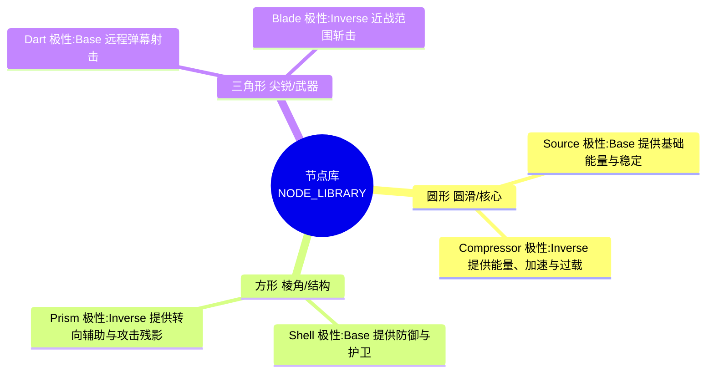
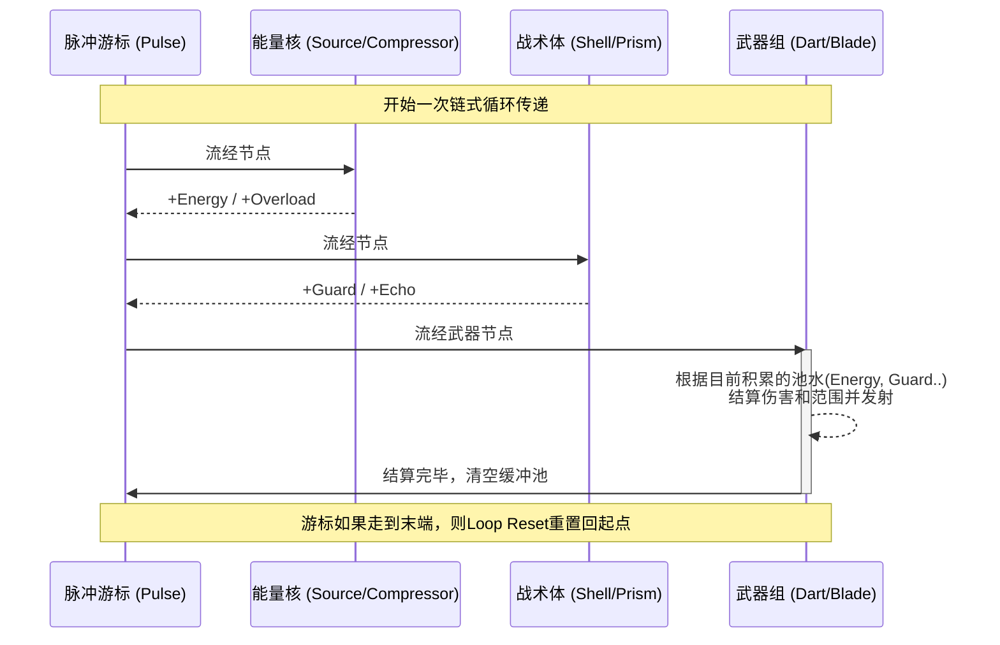

# 游戏节点与能量流架构设计文档

本文档基于现有代码库中的机制（重点参考 `app.js`），对游戏中的节点单元、连线边（Edge）、能量流（Pulse/Energy Flow）及玩家状态等系统进行解析和分类，并提供核心底层代码作为实现证据。

## 1. 节点单元 (Node Units) 设计
游戏中的可拼接节点分为三大基础形状（原型），并根据极性（Polarity）进一步细分为不同的颜色与角色设定。节点的作用主要分为三类：**提供资源 (Energy)、提供辅助与架构 (Utility)、释放攻击 (Weapon)**。



### 1.1 圆形节点 (Circle) —— 核心与资源发生器
圆形节点主要用于在能量流穿过时产生能量（Energy）。
* **Source (颜色 `COLORS.base`)**：
  * **能力**：触发时为玩家增加基础能量 `energy` 并提高当前的稳定性 `stability`。
  * **实现**：`energy = Math.min(3, energy + 1); stability = Math.min(1.2, stability + 0.08);`
* **Compressor (颜色 `COLORS.inverse`)**：
  * **能力**：以激烈的方式压缩能量，不仅提供能量，还会产生“过载”(`overload`)效果和“节奏爆发”（`tempoBoost`），但会略微增加控制上的“骚动”（`agitation`）。
  * **实现**：`energy + 1; overload + 1; tempoBoost += 0.5; agitation += 0.2`

### 1.2 方形节点 (Square) —— 护甲与战术中枢
方形节点在能量流过时负责积累战术状态，增强生存与机动性。
* **Shell (颜色 `COLORS.base`)**：
  * **能力**：坚固的护甲节点。每次触发增加一层守卫值（`guard`），并提高稳定性与基础转弯辅助（`turnAssist`）。守卫值在随后武器释放时会转化为玩家身上的实体护盾。
  * **实现**：`guard = Math.min(2, guard + 1); stability += 0.18; turnAssist = Math.max(..., 0.18)`
* **Prism (颜色 `COLORS.inverse`)**：
  * **能力**：光棱节点。为玩家赋予残影效果（`echo = 1`），让接下来的攻击发生多重重奏（延迟爆发），并大幅提升转向能力。
  * **实现**：`echo = 1; turnAssist = Math.min(1.2, turnAssist + 0.45);`

### 1.3 三角形节点 (Triangle) —— 致命武装
三角形节点是攻击的末端，**不产生能量，而是消耗当前累积的所有状态（清空能量池）进行输出。**
* **Dart (颜色 `COLORS.base`)**：
  * **能力**：发射多束跟踪/直射飞镖。`energy` 决定投射物数量和伤害；`overload` 提供额外伤害和穿透（`pierce`）。如果拥有 `guard` 会生成护盾，如果拥有 `echo`，则排入多重多重射击队列。
* **Blade (颜色 `COLORS.inverse`)**：
  * **能力**：前方大范围近战锥形斩击。`energy` 会大幅增加伤害和基础攻击范围；`overload` 会在释放斩击时额外引发局部爆炸（Burst）。

> **实现证据 (app.js `triggerNode` & `clearExecutionState`)**
> ```javascript
> // 节点能力结算核心代码 (摘录)
> switch (node.role) {
>     case 'source':
>         this.player.energy = Math.min(3, this.player.energy + 1);
>         this.player.stability = Math.min(1.2, this.player.stability + 0.08);
>         break;
>     case 'compressor':
>         this.player.energy = Math.min(3, this.player.energy + 1);
>         this.player.overload = Math.min(3, this.player.overload + 1);
>         this.player.tempoBoost = clamp(this.player.tempoBoost + 0.5, 0, 1);
>         break;
>     case 'shell':
>         this.player.guard = Math.min(2, this.player.guard + 1);
>         break;
>     case 'prism':
>         this.player.echo = 1;
>         break;
>     case 'dart':
>         this.fireVolley(node, edge); // 攻击后清空数值
>         break;
>     case 'blade':
>         this.performSlash(node, edge); // 攻击后清空数值
>         break;
> }
> // 紧接着攻击计算结束，系统会清空积累属性
> clearExecutionState() {
>     this.player.energy = 0;
>     this.player.guard = 0;
>     this.player.overload = 0;
>     this.player.echo = 0;
> }
> ```

---

## 2. 边 (Edges) 与连接的物理机制

游戏中节点的连接不仅构成表现形态，也具备物理软硬度和对能量流动的加成特性。

### 2.1 拓扑边形态分类
在 `buildPartialMeshEdges` 的生成逻辑中，分为两种拓扑连线：
1. **Spine (骨干/主脊连线)**: 依据玩家组装（`player.chain`）顺序相连的直系连线，提供最高刚度（`spineStiffness`），构筑主体。
2. **Support (支撑连线)**: 根据临近节点距离自动推导补上的网状辅助边，具有更大的软度乘数（`supportSoftness`），用于提供整体形态横向支撑。

### 2.2 能量乘数 (Edge Modifier)
连线两端节点的**“极性 (Polarity)”**（即颜色 `base/inverse`）会形成具有状态改变作用的化学反应。
当能量按顺序流动跨过连线时：
* **Steady (稳定相连)**：前一节点与当前节点极性**相同**。
  * **表现**：加强防守。增加基础稳固力（`stance: 1.16`, `stability: 1.18`，使得节点附着力度大），并为玩家整体的 `stability` 提供 `+0.12` 的正向积累。
* **Inverse (碰撞相连)**：前一节点与当前节点极性**相反**。
  * **表现**：加强侵略。极性冲突增加了覆盖范围（`reach: 1.18`）但降低稳定性（`stability: 0.82`）。碰撞相连会在流经时刺激玩家产生额外的“骚动值” (`agitation += 0.22`)，且会导致能力流动传导**加速收缩**。

> **实现证据 (app.js `getEdgeModifier`)**
> ```javascript
> getEdgeModifier(chainIndex) {
>     const previous = this.activeNodes[chainIndex - 1];
>     const current = this.activeNodes[chainIndex];
>     if (previous.polarity === current.polarity) {
>         // 同极性：稳定
>         return { kind: 'steady', reach: 0.94, stance: 1.16, stability: 1.18 };
>     }
>     // 异极性：狂躁/冲突
>     return { kind: 'inverse', reach: 1.18, stance: 0.84, stability: 0.82 };
> }
> ```

---

## 3. 能量流体系 (Pulse Flow System)

核心玩法建立在**“在链式结构上传递能量节拍” (Pulse Flow)**的基础上。



### 3.1 节拍运转与时间计算
* **游走机制**：游戏维护着 `player.pulseCursor`（当前位置） 和 `player.pulseTimer`（倒计时）。
* **传递速率**：能量每跳过一个节点的耗时（`getPulseInterval`）默认取决于 `loopReset`。但存在多个**动态加速因素**：
  * **异极性加速**：从一个节点流向不同极性的下一个节点时，间隔时间乘以 `0.94`。
  * **手动加速**：玩家按下 Shift 键，整体速度乘以 `0.92`。
  * **节奏爆发**：由 Compressor 提供的 `tempoBoost` 会继续缩短间隔时间。
  
### 3.2 自律与张力引擎
因为有能量流不断的驱动（结合拓扑和排斥力积分），整个生物体呈现出了有生命力的微观表现（PBD位置校正与动力学）。能量游走到哪，哪一边就会得到力学特性的 Plant/Anchor（固定拉力），使躯体像履带虫或鞭毛软体一样靠节点次第发力来进行有规律的飘移或攻击。

---

## 总结
该游戏采用了**“组装产生拓扑 -> 拓扑决定骨架 -> 脉冲沿拓扑游走 -> 游走触发能力叠加 -> 末端释放”**的精巧机制。颜色和形状在不仅仅是视觉识别特征，也在底层物理引擎弹簧系数、能量传播节奏以及武器属性结算上互相深度交织。
